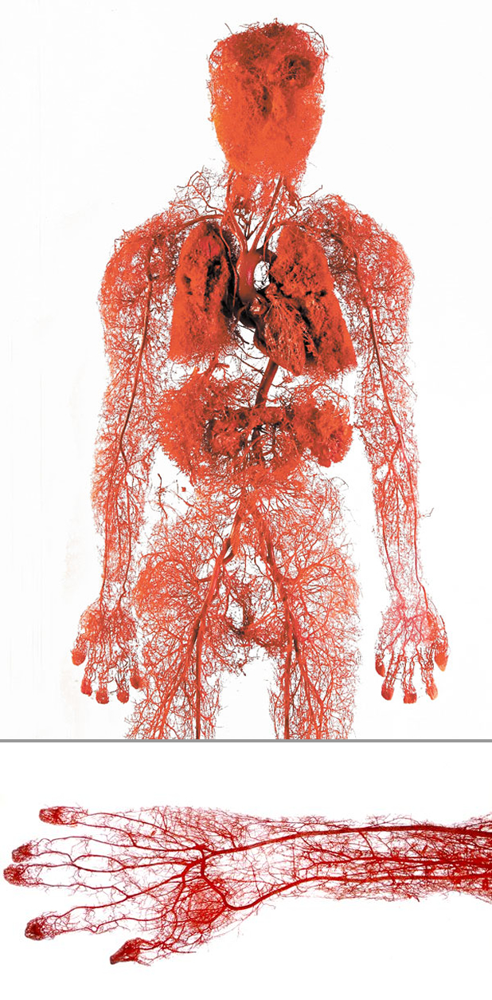

# Кровеносная система — рабочие образы

Это одна из структур, пронизывающих, все ткани нашего тела, в отличие от других таких как, мышцы или кости, у которых можно найти начало и конец, эту затруднительно сегментировать вообще.

Она простирается от кончиков пальцев ног до макушки головы, последовательно пронизывая все ткани нашего тела состоящие из живых клеток, выполняя, таким образом, ярко выраженную связывающую функцию.  

Также вместе с главным диспетчером нашего тела — сердцем и крупными артериями и венами, эта система играет центрирующую функцию, проводя, кровь из чрезвычайно разветвлённой сети капилляров к центрам периферии, к сердцу и лекгим, по самым коротким и прямым путям их возможных.

Предлагается представить сердце, аорту и основные артерии и вены как диспетчера и проводников играющих также центрирующую роль, а капилляры как заросли, паутину, болото играющие связующую и структурирующую функцию.  

После, поработать сразу со всем этим большим интегрирующим образом тела начиная от спокойных, статичных положений, заканчивая более динамичными и функциональными.  
