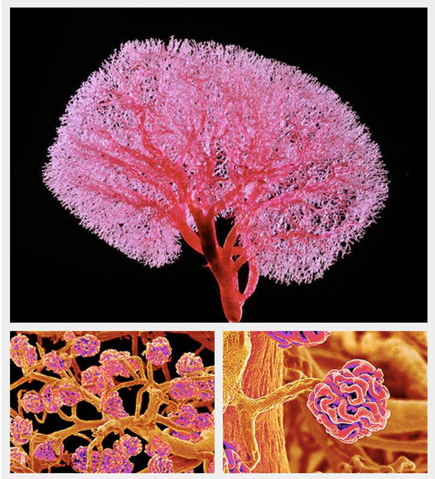
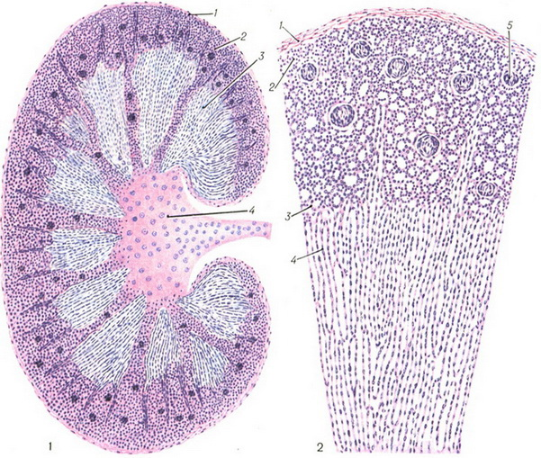
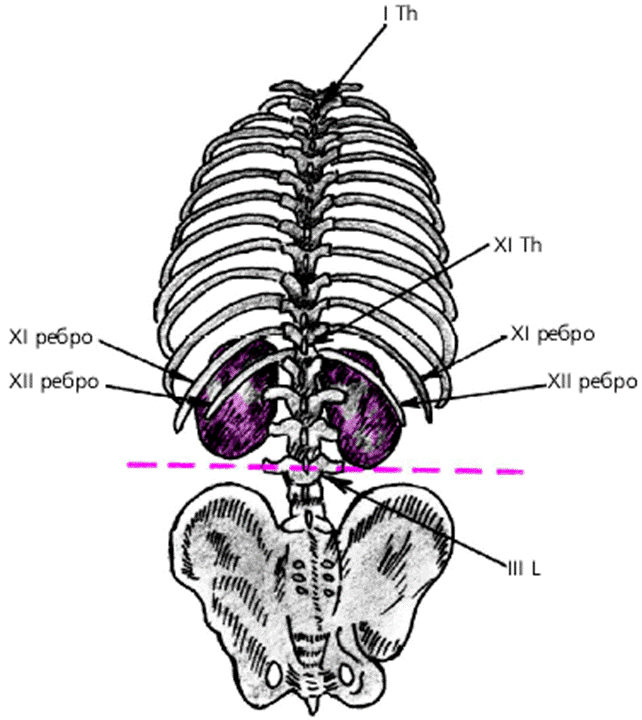
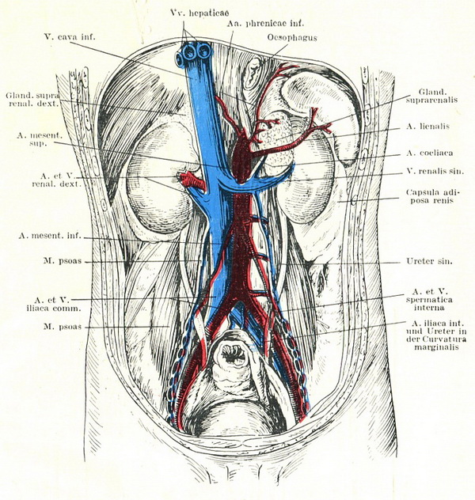
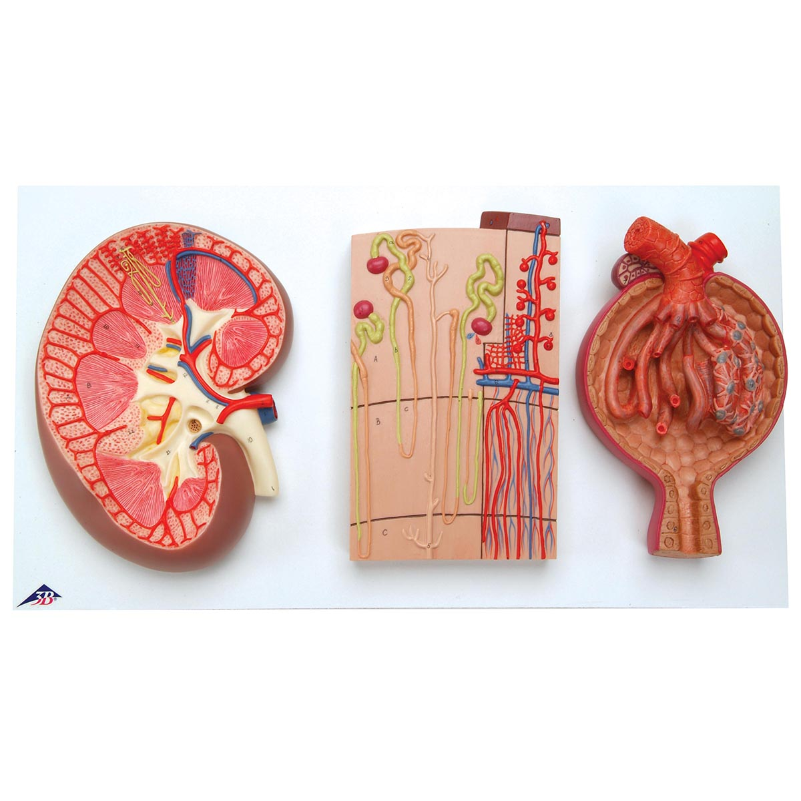

# Почки

Почка покрыта капсулой, имеющей два слоя и состоящей из коллагеновых волокон с незначительной примесью эластических, и слоем гладких мышц в глубине. Последние непосредственно переходят в мышечные клетки звездчатых вен. Капсула пронизана кровеносными и лимфатическими сосудами, тесно связанными с сосудистой системой не только почки, но и околопочечной клетчатки. Структурной единицей почки является нефрон, включающий в себя клубочек вместе с капсулой Шумлянского—Боумена (составляющих вместе почечное тельце), извитые канальцы I порядка, петлю Генле, извитые канальцы II порядка, прямые канальцы и собирательные трубочки, открывающиеся в чашечки почки (цветн. табл., рис. 1 — 5). Общее количество нефронов — до 1 млн.

разрез почки
Рис. 1. Фронтальный разрез почки (схема): 1 — капсула; 2—корковое вещество; 3 — мозговое вещество (пирамиды Мальпиги); 4 — почечная лоханка.  
[Источник](http://www.medical-enc.ru/m/15/pochki-gistologiya.shtml)  

#### Топография (Скелетотопия)

### Полезные факты

- Основными функциями почек являются
выделительная и водовыделительная. Первая обеспечивает выведение с мочой всех подлежащих удалению продуктов метаболизма и чужеродных (токсических и безразличных) веществ. Вторая регулирует постоянство объема внеклеточной жидкости.
- Эндокринная функция почек. В почках синтезирутся фермент ренин и гормон эритропоэтин они помогает организму сохранять воду и регулировать объем циркулирующей крови, это влияет на аретриальное давление.
- Метаболическая функция почек. В почках происходит превращение и синтез многих веществ необходимых для нормального функционирования организма (например превращение витамина D в его наиболее активную форму — 1,25-дигидроксихолекальциферол (витамин D3 ).
- Регуляция кислотно-щелочного баланса – почки поддерживают нормальное соотношение щелочного и кислотного компонента плазмы крови путем выделения избытка ионов водорода (Н+ ) или бикарбоната (НСО3- ).
[Источник](http://www.tiensmed.ru/illness/pochki1.html)
- Почки участвуют в химическом теплобмене организма, в составе выделительной системы.

### Рабочий образ

Представить сердце, аорту и вырастающие из аорты сеть капиляров, формирующие почки. Представить пространство внутри капиляров и межуду ними, образ их проницаемости и проводимости.  
Обратить внимание на работу диафрагмы, сокращение и расширение мышц и тканей при двохе и выдохе.  
После, представить потоки, ручейки тепла следующие от сердца к почкам при выдохе и ручейки холода поднимающиеся от почек к сердцу при вдохе. Наблюдать какое-то время этот процесс, не вмешиваясь в него.  
Посмотреть как этот процесс вляет на движение и можно ли двигатся сохраняя внимание на нем.     

### Картинки для вдохновения

    
