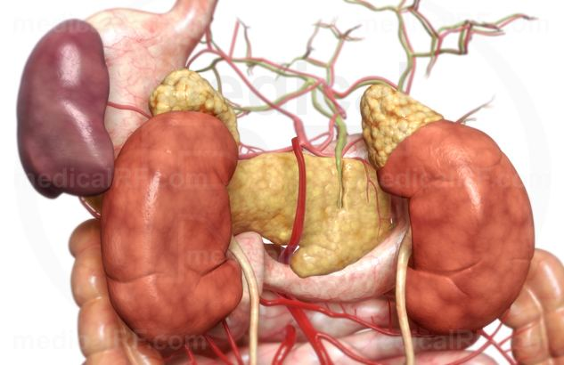

# Селезенка

Селезенка — часть лимфатической системы, губчатый орган темно-красного
цвета, расположена в брюшной полости слева, за желудком, на уровне 9-11
ребер, на 4–5 см не доходя до позвоночника.. Имеет форму уплощенной и
удлиненной полусферы. Весит 200–250 г. Соприкасается с диафрагмой,
задней стенкой желудка, левой почкой и надпочечником, поджелудочной
железой, толстым кишечником. Двумя связками, удерживающими ее в одном
положении, селезенка соединена с желудком и диафрагмой.  Почти полностью
окружена брюшиной. 

**Функции**:

1.   образование иммунных клеток крови - лимфоцитов и моноцитов (на
    ранней стадии внутриутробного развития продуцирует также лейкоциты и
    эритроциты, очаги кроветворения могут появляться и в дальнейшем в
    течение жизни)
2.   выработка антител
3.   фильтрация крови (захват и уничтожение бактерий, инородных частиц и
    т. д.; разрушение старых и поврежденных эритроцитов и тромбоцитов
    (остатки выводятся в печень). Процеживает 100-200 мл крови в минуту.
4.   Депонирование крови (селезенка может накапливать в себе до 300мл
    крови - в том числе до одной трети всех тромбоцитов - которая
    высвобождается при сильных кровопотерях)
5.   Участвует в обмене веществ, синтезируя некоторые белки, необходимые
    для работы иммунной системы.
6.   накапливает железо, которое необходимо для образования гемоглобина

Функции селезенки изучены не до конца, по некоторым теориям, она
является частью эндокринной системы (участвует в гормональной регуляции
функции костного мозга).

**Строение**  
Снаружи селезенка покрыта плотной эластичной оболочкой, перемычки
которой распространяются внутрь органа, образуя трабекулы - каркас из
соединительной ткани. И в оболочке, и в перемычках встречаются мышечные
волокна, благодаря которым селезенка может растягиваться до определенных
размеров, не разрываясь. Ткань органа называется пульпой. Она бывает
двух видов: красная и белая. Красная пульпа похожа на трехмерную рыбачью
сеть, волокна которой – опорные клетки, переплетенные между собой, а
ячейки заполнены клетками, которые разрушают эритроциты и бактерии. Вся
сеть пронизана капиллярами, из которых кровь просачивается прямо в
пульпу.  
Белая пульпа образована скоплениями лимфоцитов и лимфатическими узлами.  
Границу между красной и белой пульпой образуют специфические клетки,
отвечающие за иммунную защиту организма. Такое строение органа позволяет
ему совмещать несколько разных функций.

**Кровоснабжение**  
Находится на пути тока крови из брюшной аорты (от нее к воротам
селезенки подходит селезеночная артерия) в систему воротной вены (в нее
впадает селезеночная вена), которая разветвляется в печени.

Вместе с печенью селезенка дает горизонтальную поддержку диафрагме,
т.е., помогает выстроить вертикаль и может поддерживать тело во
вращении.

