# ЖКТ

*Пищеварительная система* включает в себя ЖКТ (ротовая полость, глотка,
пищевод, желудок, кишечник) и органы и железы, участвующие в пищеварении
(слюнные железы, печень, желчный пузырь, поджелудочная железа).

*ЖКТ* — единая длинная эластичная трубка (около 9 метров) от рта до
ануса, «органический позвоночник». Образован несколькими слоями тканей:

-   слизистая
-   слой соединительной ткани
-   мышечный слой
-   наружная серозная оболочка

*Ротовая полость* — пища формируется в пищевой комок, который
проталкивается языком к глотке, где надгортанник направляет ее в
пищевод, защищая дыхательные пути.

*Пищевод* — трубка примерно 2 см в диаметре и 25 см в длину.

*Желудок* — полый орган слева под диафрагмой, ближе к передней стенке
брюшной полости. Мышечные стенки образованы тремя слоями мышечных клеток
с разными направлениями волокон. Несмотря на то, что он включен в единую
пищеварительную трубку, желудок отделен и от пищевода и от тонкого
кишечника сфинктерами. Сфинктеры желудка закрыты до тех пор, пока их не
достигает еда, т. к. желудок имеет кислую среду, если сфинктеры по
каким-то причинам нарушены, кислота, попадающая из желудка в пищевод или
тонкий кишечник, может повредить слизистые. В желудке пища проходит
первичную, механическую, и частично химическую обработку, превращаясь в
гомогенную массу. Затем она попадает в тонкий кишечник.

*Тонкий кишечник* — трубка длиной около 6 метров. Состоит из трех
частей: *двенадцатиперстной*, *тощей* и *подвздошной* кишки. В тонком
кишечнике (особенно в двенадцатиперстной кишке) пища проходит
дезинфекцию желчью, здесь из нее извлекается большая часть питательных
веществ. Поверхность слизистой тонкого кишечника покрыта ворсинками,
благодаря которым поверхность всасывания питательных веществ еще больше
увеличивается.

*Толстый кишечник* — более толстая трубка, разделенная на секции. Здесь
в основном происходит всасывание воды из пищи и формирование каловых
масс. Начинается со *слепой кишки* (нижняя часть брюшной полости
справа), в которую впадает подвздошная кишка тонкого кишечника. От
слепой кишки отходит *аппендикс* — червеобразный отросток, который
участвует в работе иммунной и лимфатической систем и является местом
хранения для дружественных организму бактерий.

Слепая кишка переходит в *ободочную кишку*, которая состоит из трех
сегментов: *восходящая* кишка (правая сторона брюшной полости, снизу
вверх), *поперечная* (верхняя часть брюшной полости, справа налево),
*нисходящая* (левая сторона брюшной полости, сверху вниз). Работа с
ободочной кишкой помогает сбалансировать левую и правую стороны тела.

Ободочная кишка переходит в *прямую кишку*, которая заканчивается
анальным отверстием и имеет сфинктеры, которые человек может до
определенного момента удерживать сознательно.

*Печень* — плотный губчатый орган, располагается сразу под диафрагмой,
под правым легким и доходит до середины левой стороны тела. Имеет две
доли, располагается ближе к задней поверхности тела. Вес печени — около
1,5 кг. Плотная ткань, насыщенная кровью. Печень выполняет более 200
функций (очищение крови, участие в обмене веществ, хранение веществ и
т.д). Печень имеет врата — место вхождения сосудов. Кровеносные сосуды
из тонкого кишечника напрямую попадают в печень, а оттуда обработанная
кровь попадает в полую вену.

*Желчный пузырь* — полый орган, расположен под печенью, протоки выходят
в верхний отдел тонкого кишечника, выводя желчь, которая участвует в
химической обработке и дезинфекции пищи и усиливает перистальтику.
Прилегает к нижней поверхности печени.

*Поджелудочная железа* — губчатый орган, выполняет и экзокринную функцию
в работе пищеварительной системы, и эндокринную функцию. Имеет
удлиненную форму, расположена под и за желудком, голова поджелудочной
лежит в изгибе двенадцатиперстной кишки, хвост направлен влево, чуть
назад и чуть наверх, упирается в селезенку.

*Брюшина* — фасциальная мембрана во внутреннем пространстве брюшной
полости, внешняя поверхность которой крепится к мышечно-скелетным
стенкам, а внутренняя обтекает органы, поддерживая их на своем месте.

Спереди между органами и мышцами брюшной стенки расположен *большой
сальник*. Это дополнительный защитный слой — амортизирует, согревает
органы, содержит стратегические запасы организма, выполняет иммунную
функцию (содержит большое количество иммунных клеток). Большой сальник
образован двойным слоем брюшины, он как бы подвешен сразу под желудком
на толстой поперечной кишке.

Во внутреннем пространстве брюшной полости часть брюшины, отходя от
заднейстенки брюшной полости, создает *брыжейку* — множество фасциальных
складок, в которые затянут тонкий кишечник. Брыжейка притягивает тонкий
кишечник к спине, балансируя переднюю и заднюю поверхности. Если
брыжейка и мышцы живота сбалансированы, то у внутренних органов
появляется хорошая поддержка. В брыжейку также упакованы все нервные,
лимфатические и кровеносные пути, питающие и иннервирующие кишечник.

В пищеварительной системе столько же нейронных ядер, сколько в спинном
мозге, и их можно рассматривать как отдельный мозг. Это так называемый
первичный, примитивный мозг, мы обнаруживаем его уже у допозвоночных.

*Перистальтика* — ритмичные последовательные волнообразные сокращения
ЖКТ, продвигающие пищу. Этот процесс запускается в момент глотания.
Мышцы ЖКТ имеют спиралевидную структуру (это помогает продвижению пищи
по тракту). Перистальтика поддерживается также движениями диафрагмы.

Полный цикл переваривания пищи занимает около суток.

### Картинки для вдохновения
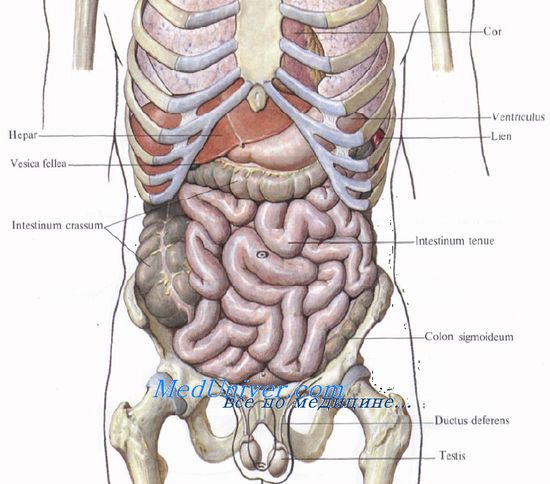

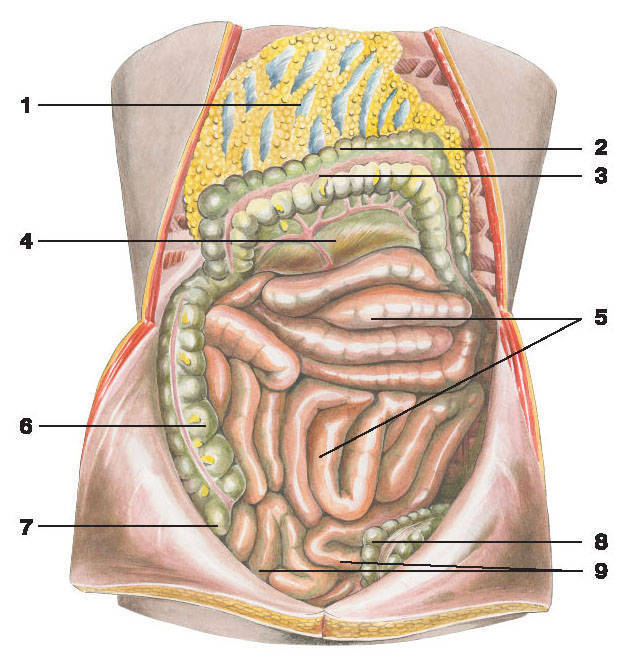

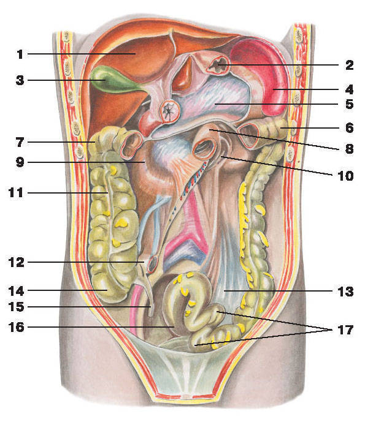

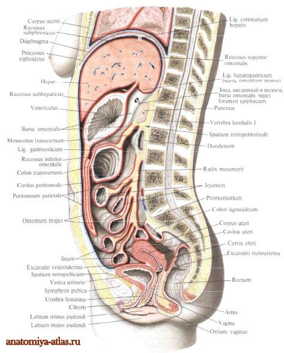

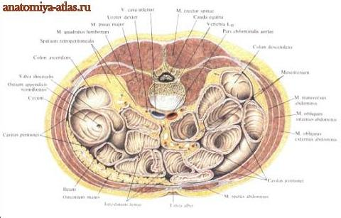

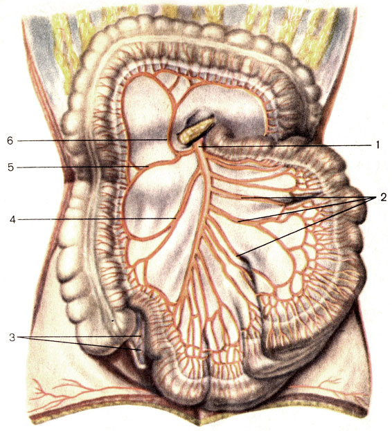

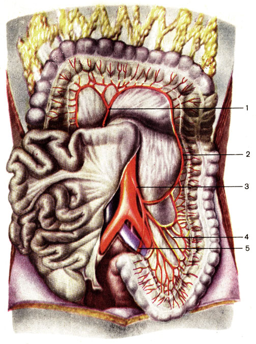

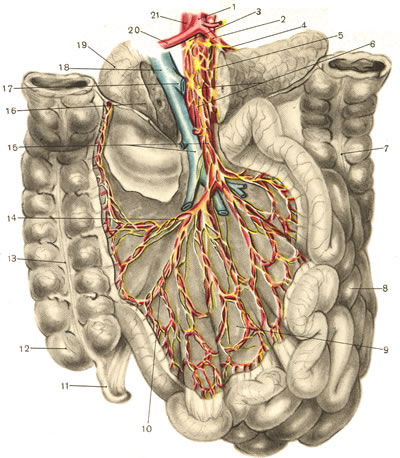

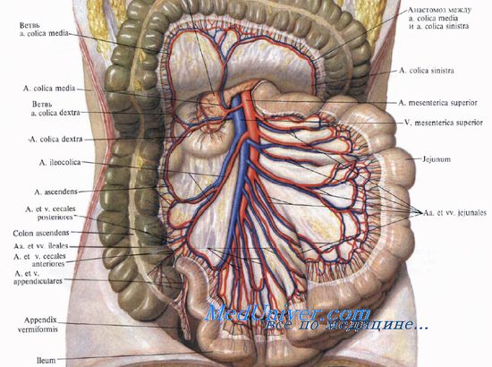

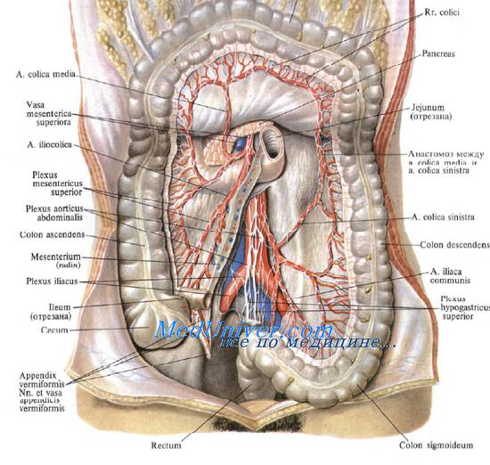

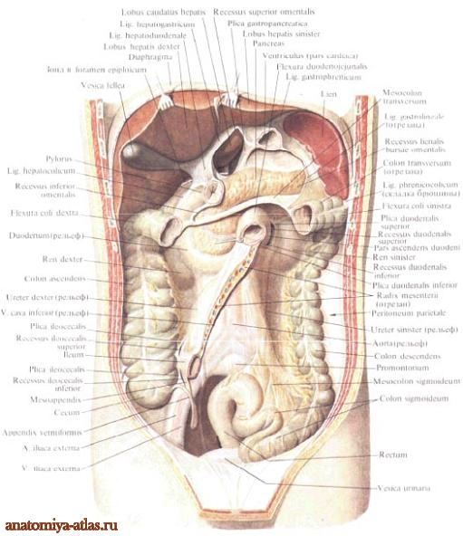

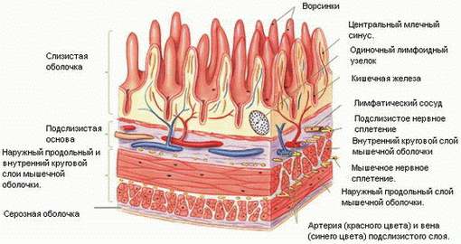

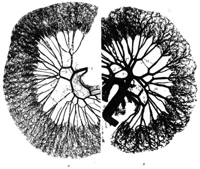

### Толстая кишка

**Воро́тная ве́на**  (лат. vena portae) у человека и животных — венозный ствол, по которому кровь от желудка, селезёнки, кишечника (кроме нижней трети прямой кишки у людей) и поджелудочной железы проходит в печень. Название происходит от «ворот» печени, куда она впадает.

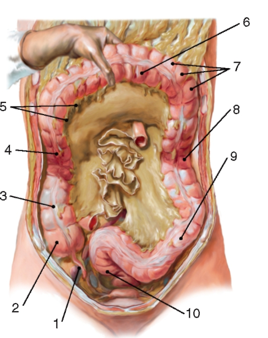

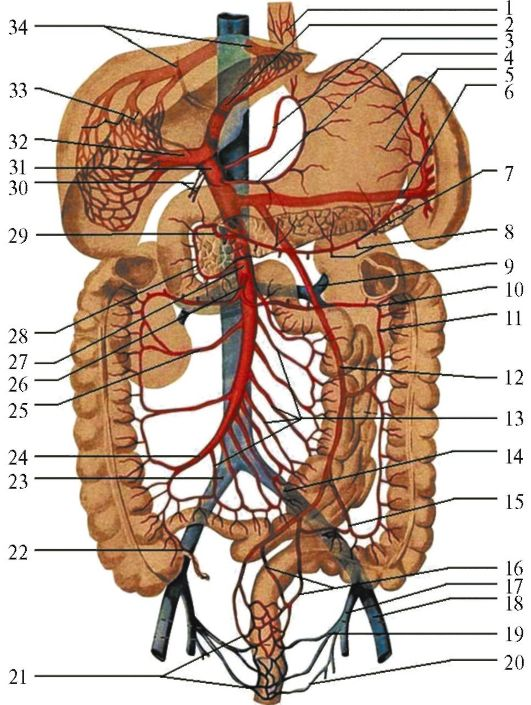

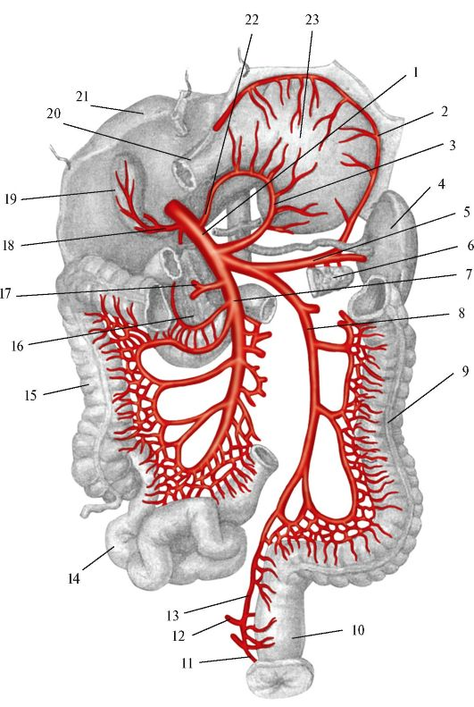

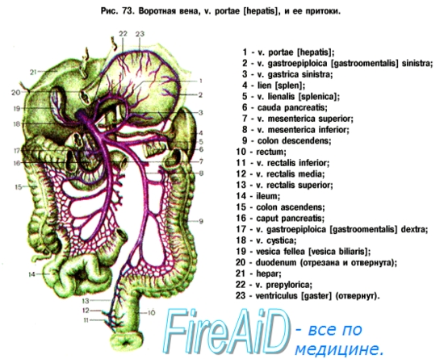
